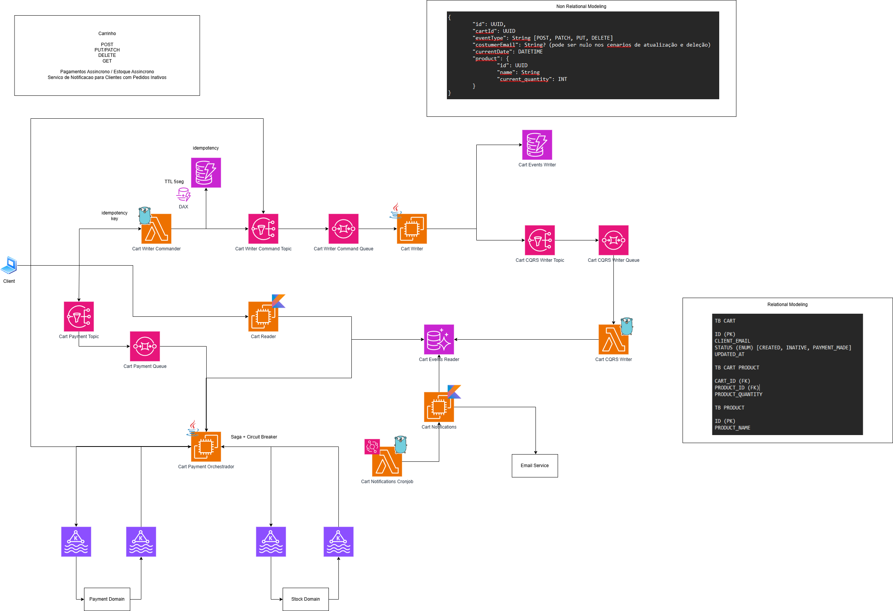

# Serviço/Simulação de um Carrinho

Implementação de um sistema de carrinho de compras distribuído utilizando padrões modernos de arquitetura orientada a eventos e microsserviços.

## Arquitetura

A arquitetura segue um modelo distribuído de microsserviços onde cada componente é responsável por uma funcionalidade específica. O sistema comunica-se através de eventos assíncronos, garantindo baixo acoplamento e alta escalabilidade.

### Blocos Principais

**1️⃣ API de Carrinho**
- Operações: `POST` (criar), `PATCH`/`PUT` (atualizar), `DELETE` (remover), `GET` (consultar)
- Pagamento assíncrono através de eventos
- Notificações automáticas para carrinhos inativos

**2️⃣ Camada de Comandos (Write Side – CQRS)**
- `Cart Writer Commander` (Lambda): recebe e valida comandos, verifica idempotência
- `Idempotency Store` (DynamoDB + DAX): armazena keys de idempotência com TTL de 5 segundos para evitar duplicação
- `Cart Writer Command Topic` (SNS): publica comandos para fila
- `Cart Writer Command Queue` (SQS): desacopla processamento
- `Cart Writer` (Serviço Java): consome fila, aplica regras de domínio, gera eventos (`CartCreated`, `ProductAdded`, `ProductRemoved`, `CartDeleted`)

**3️⃣ Event Store**
- Persistência no DynamoDB com modelo de Event Sourcing
- Cada evento armazena: `id`, `cartId`, `eventType`, `customerEmail`, `timestamp`, `productDetails`
- Permite reconstruir o estado completo de qualquer carrinho a partir do histórico

**4️⃣ Projeção CQRS (Read Side)**
- Consome eventos do Event Store através de Topic → Queue → Lambda
- Transforma dados em modelo relacional otimizado para leitura no PostgreSQL
- Tabelas: `TB_CART`, `TB_CART_PRODUCT`, `TB_PRODUCT`
- Oferece leitura rápida sem necessidade de reconstruir eventos

**5️⃣ Sistema de Pagamentos (Saga)**
- `Cart Payment Orchestrator`: coordena transações distribuídas
- Interage com: `Payment Domain` (autorizar/capturar pagamento) e `Stock Domain` (reservar/confirmar estoque)
- Implementa Saga com compensating transactions em caso de falha
- Inclui Circuit Breaker para evitar falhas em cascata

**6️⃣ Sistema de Notificações**
- `Cart Notifications Cronjob`: executa periodicamente para identificar carrinhos inativos
- `Cart Notifications Service`: processa e qualifica carrinhos para notificação
- `Email Service`: responsável pelo envio de emails para clientes

A persistência de eventos é garantida através do DynamoDB (Event Store), permitindo reconstruir o estado completo de qualquer entidade através do histórico de eventos.

### Design Patterns

A solução implementa os seguintes padrões de arquitetura:

- **EDA (Event-Driven Architecture)**: toda comunicação entre serviços ocorre através de publicação e consumo de eventos via SNS/SQS, garantindo desacoplamento e escalabilidade horizontal
  
- **Hexagonal Architecture (Ports & Adapters)**: isolamento do domínio de negócio da infraestrutura através de portas (interfaces) e adaptadores (implementações), facilitando testes unitários e manutenção
  
- **CQRS (Command Query Responsibility Segregation)**: separação clara entre operações de escrita (Write Side - recebe comandos e persiste eventos) e leitura (Read Side - otimizado para queries através de projeções)
  
- **Event Sourcing**: estado do carrinho é derivado de uma sequência imutável de eventos, oferecendo auditoria completa e capacidade de reconstruir estado em qualquer momento
  
- **Saga Pattern**: coordenação de transações distribuídas entre múltiplos dominios (Pagamento e Estoque) com suporte a compensating transactions para rollback distribuído em caso de falha
  
- **Idempotency**: garantia de que comandos duplicados não causem efeitos duplicados através de armazenamento de chaves de idempotência com TTL curto
  
- **Circuit Breaker**: proteção contra falhas em cascata com estados (Closed, Open, Half-Open), retry automático com backoff exponencial e fallback

## Fluxo da Peça

A arquitetura atual conta com as seguintes funcionalidades principais:

### Gestão de um Carrinho

**Fluxo: Criar ou Atualizar Carrinho**

1. Cliente chama API: `POST /cart`, `PATCH /cart`, `PUT /cart` ou `DELETE /cart`
2. `Cart Writer Commander` (Lambda) recebe o comando e valida:
   - Idempotency key (verifica no DynamoDB + DAX)
   - Request payload
3. Lambda publica comando no `Cart Writer Command Topic` (SNS)
4. Mensagem é enfileirada no `Cart Writer Command Queue` (SQS) para processamento desacoplado
5. Serviço `Cart Writer` (Java) consome da fila:
   - Aplica regras de domínio e validações
   - Gera eventos de domínio (`CartCreated`, `ProductAdded`, `ProductRemoved`, `CartDeleted`)
6. Eventos são persistidos no `Event Store` (DynamoDB)
7. Eventos publicados no `Cart CQRS Writer Topic` para iniciar projeção
8. Lambda de projeção consome do `Cart CQRS Writer Queue` e atualiza o read model no PostgreSQL

**Operações Suportadas:**

- Adicionar produtos no carrinho com validação de disponibilidade
- Editar quantidade de produtos com ajuste automático de totais
- Remover itens do carrinho com rollback automático em caso de falha
- Visualizar estado atual do carrinho em tempo real com dados do read model

**Fluxo: Leitura de Carrinho**

- Cliente consulta: `GET /carts/{cartId}` ou `GET /carts`
- Consulta vai diretamente para PostgreSQL (read model)
- Retorna dados de forma rápida sem reconstruir eventos
- Alternativa: `Cart Events Reader` reconstrói estado do Event Store quando necessário

### Pagamento de um Carrinho

**Fluxo: Processar Pagamento (Saga)**

1. Cliente inicia pagamento: `POST /carts/{cartId}/checkout`
2. Comando publicado no `Cart Payment Topic`
3. Mensagem enfileirada no `Cart Payment Queue`
4. `Cart Payment Orchestrator` consome e inicia Saga:
   - **Passo 1**: Tenta autorizar pagamento com `Payment Domain`
   - **Passo 2**: Se autorizado, tenta reservar estoque com `Stock Domain`
   - **Passo 3**: Se tudo OK, captura pagamento
5. Em caso de falha em qualquer etapa:
   - Passo 3 falha → cancela captura (sem compensation)
   - Passo 2 falha → libera estoque (compensation)
   - Passo 1 falha → nothing to compensate
6. Implementa Circuit Breaker para evitar novas tentativas em caso de falha sistemática
7. Notificar Sistema de Pagamentos e Estoque de confirmação/cancelamento de pedido

### Serviço de Notificação

**Fluxo: Notificar Carrinhos Inativos**

1. `Cart Notifications Cronjob` executa periodicamente (ex: a cada hora)
2. Consulta read model ou Event Store para identificar carrinhos sem atividade há 7+ dias
3. `Cart Notifications Service` processa carrinhos qualificados:
   - Filtra por status e data de última atualização
   - Prepara templates de email personalizados
4. Envia notificações através de `Email Service`
5. Atualiza status do carrinho para refletir notificação enviada

**Notificações Adicionais:**

- Notificação via email quando carrinho é criado
- Notificação quando produtos são adicionados/removidos
- Notificação quando carrinho é atualizado
- Eventos críticos de falha de pagamento

## Stack/Bibliotecas

### Linguagens

- **Java**: linguagem principal para implementação dos microsserviços backend, com foco em robustez e performance no Cart Writer
- **Kotlin**: extensões e utilitários para aumentar produtividade e reduzir boilerplate do Java
- **Golang**: serviços críticos de alta performance e consumo reduzido de memória
- **Terraform**: definição de toda infraestrutura como código para reproducibilidade e versionamento

### Infra Cloud

- **AWS EC2**: computação escalável para hospedar os serviços e garantir HA/DR
- **AWS Lambda**: funções serverless para `Cart Writer Commander`, `Cart CQRS Writer`, `Cart Notifications Service`
- **AWS RDS (PostgreSQL)**: banco de dados relacional para armazenar projeções CQRS otimizadas para leitura
- **AWS DynamoDB**: banco NoSQL para armazenamento do Event Store, Idempotency Store e DAX para caching distribuído com baixa latência
- **AWS SNS/SQS**: serviços de mensageria para comunicação assíncrona e desacoplada entre serviços com retry automático
- **Apache Kafka**: event streaming distribuído para volume alto de eventos em tempo real e garantia de ordering por partition key